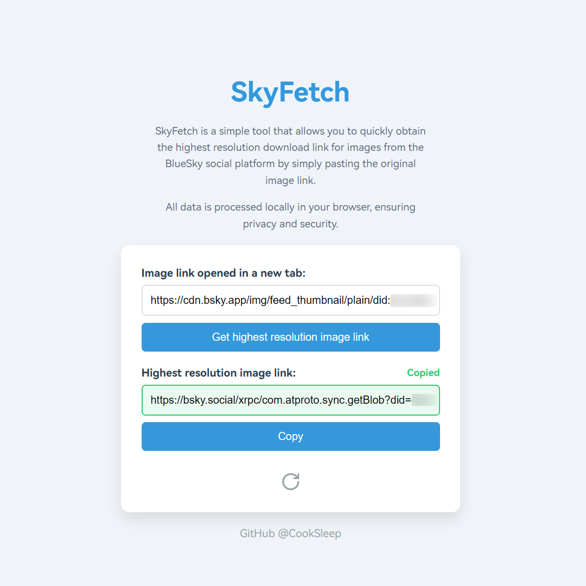
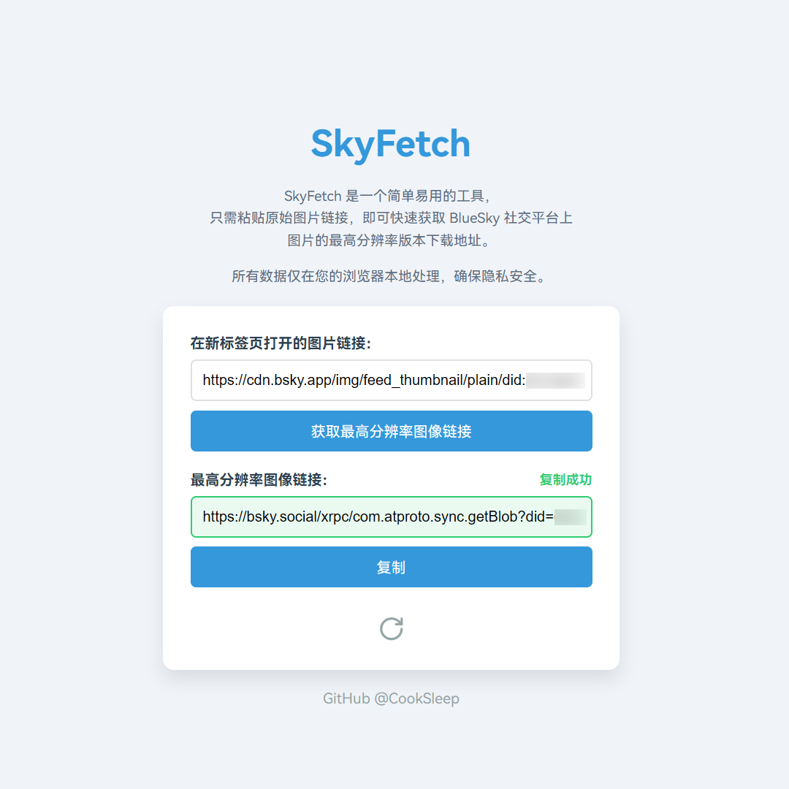

<h1 align="center">SkyFetch</h1>

  <a href="#english">English</a> | <a href="#中文">中文</a>

SkyFetch is a simple and user-friendly online tool for obtaining high-resolution download links for images from the BlueSky social platform.

Users can quickly get direct download links for high-resolution images by simply pasting the original image link. All data processing is done locally in the user's browser, ensuring privacy and security.

The code for this project was primarily written by `claude-3.5-sonnet` and `chatgpt-4o-latest`, with numerous style and functionality design suggestions and feedback provided by me.

## Features

- Quickly convert BlueSky image links to high-resolution version download addresses
- Clean and intuitive user interface
- Automatic copying of converted links
- Responsive design, supporting both desktop and mobile devices
- Local data processing to protect user privacy
- Supports Chinese and English interfaces, automatically switching based on browser language

## How to Use

1. Visit [SkyFetch](https://cooksleep.github.io/skyfetch/).
2. In the BlueSky web version, long-press/right-click on an image and select "Open image in new tab".
3. Copy the image URL from the new tab.
4. Paste the copied URL into the SkyFetch input box.
5. Click the "Get highest resolution image link" button or press Enter.
6. The converted high-resolution image link will be automatically copied to your clipboard.
7. Open the high-resolution image in a new tab using the link and long-press/right-click to download.

## Contributing

Contributions to the project are welcome! If you have any suggestions or want to add new features, feel free to create an Issue or Pull Request.

## License

This project is licensed under the [GNU General Public License v3.0](https://www.gnu.org/licenses/gpl-3.0.html). See the [LICENSE](LICENSE) file for details.

---

SkyFetch 是一个简单易用的在线工具，用于获取 BlueSky 社交平台上图片的最高分辨率版本下载地址。

用户只需粘贴原始图片链接，即可快速获取高分辨率图像的直接下载链接。所有数据处理均在用户的浏览器本地进行，确保隐私安全。

该项目的代码主要由 `claude-3.5-sonnet` 和 `chatgpt-4o-latest` 编写，我提供了非常多的样式、功能设计提议和反馈。

## 功能特性

- 快速转换 BlueSky 图片链接为高分辨率版本下载地址
- 简洁直观的用户界面
- 自动复制转换后的链接
- 响应式设计，支持桌面和移动设备
- 本地数据处理，保护用户隐私
- 支持中文和英文界面，根据浏览器语言自动切换

## 如何使用

1. 访问 [SkyFetch](https://cooksleep.github.io/skyfetch/) 。
2. 在 BlueSky 网页版中，长按/右键图片并选择“在新标签页中打开图片”。
3. 复制新标签页中的图片 URL。
4. 将复制的 URL 粘贴到 SkyFetch 的输入框中。
5. 点击"获取最高分辨率图像链接"按钮或按回车键。
6. 转换后的高分辨率图像链接将自动复制到剪贴板。
7. 在新标签页中使用该链接打开高分辨率图像并长按/右键图片以下载。

## 贡献

欢迎对项目进行贡献！如果您有任何建议或想要添加新功能，请随时创建一个 Issue 或 Pull Request。

## 许可证

本项目采用 [GNU General Public License v3.0](https://www.gnu.org/licenses/gpl-3.0.html) 许可证，详情请见 [LICENSE](LICENSE) 文件。